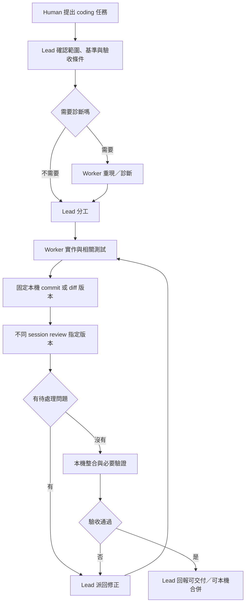

# 本機 Git Coding Workflow

日期：2026-10-02。依使用者提供的分享對話與後續要求改為本機 Git 流程，不推 GitHub。保留 Lead 拆解與分派原則，不加入 Bricks Builder skill。

## 實作狀態（2026-10-02）

首版 runtime 已接入，live Discord／Herdr／CLI 尚未驗收。入口是 `team ask --coding <prompt>`。一般 `team ask`、零 Worker 與 prompt 原文保持原行為。

已接入：同一 scheduler、TaskState、blocked／cancel／restart 與 8／16／64 輪數限制；Assignment 的 role／access／write scope／artifactRefs／findingRefs；coding stage；工作樹外 artifact；base／head SHA 或 staged／unstaged／明確 untracked 指紋；既有 dirty baseline；review 執行成功與 verdict 分開；跨輪 finding／artifact reference；結案 gate。Schema v3，可讀 v1／v2。

未接入，也不能用 prompt 宣稱已完成：Lead 直接實作後再回派 review、多 writer、worktree 隔離、GitHub／push，以及只審查現況、沒有 implement artifact 的 review。Write scope 與 session 檢查不是作業系統隔離。Bridge 不重跑 Worker 回報的測試命令，也不把 ignored 檔或 submodule 算進指紋。

2026-10-02 已補：diagnose／review／verify 記錄開始與結束指紋。review 或 verify 期間工作樹改變、缺少開始指紋，或 review 對不上實作 artifact 時，報告留檔但為 inconclusive 或驗證未通過；pass 不會改貼到開始或結束版本，也不會因此解決 findings 或結案。同輪有 writer 時，其他 assignment 必須依賴它。重複的 finding 原始 id 保留第一筆，其後存成 `assignmentId:id`，`findingRefs` 用已儲存 id。詳見 ISSUE-025。

以下各節保留原始設計，包含尚未實作的後續步驟。若下文仍寫「沒有欄位」或「只有提案」，那是接上 runtime 之前的設計紀錄；首版範圍以本節與 ISSUE-025 為準。先前「question cap blocked、尚無交付」的註記已被這次原始碼與自動化測試取代；那不是 live 驗收。

## 核心原則

`team ask` 仍由 Lead 理解需求、拆解任務、選擇 Worker、安排依賴、決定修正與最終回報。Bridge 驗證／執行 Lead 計畫，管理 session、等待、持久化與取消。

本機 commit／diff 作為交接依據，獨立 Agent 產生本機 review report，本機 test runner 提供驗證結果。整個流程不需要 remote、GitHub 帳號、PR、線上 approval 或 CI；不執行 push 或 GitHub 發布操作。

Role 是本次任務責任；Skill 是工作指引；Agent 是 pane 中的 CLI／session。Lead 動態分配診斷、實作、review、驗證，不固定模型或強制每個任務跑全部角色。Reviewer 必須與作者使用不同已知 session/context；不同 pane 不等於不同 session。

## 流程

診斷按需執行；測試從實作階段開始。小修正可由 Lead 直接實作，需要獨立 review 時仍另派 session。原則上先用一個作者加一個 reviewer；只有能分成互不干擾的模組才平行使用多個 writer。

Reviewer 預設不改產品檔案，回報 findings，由 Lead 決定 owner 與下一輪修正。Lead 核對實際 diff 與測試，不能只依 Worker 回覆「完成」結案。

## 交接版本：commit 或未提交 diff

### 已提交模式

保存 repository、branch、base SHA、head SHA。Reviewer 審查確切 base → head 的變更；測試也針對該 head 執行。Commit 只存本機，不需要 push。

修改後產生新 head；舊 review／test 結果需重新核對，不能直接套到新版。若在本機整合分支產生新 commit，還需驗證整合後的 SHA，並核對目標分支基準。

### 未提交模式

不要求使用者為了 review 先 commit。保存 base SHA、staged／unstaged diff、涉及的 untracked 檔案內容與指紋；只保存 `git diff` 會漏掉 untracked，不能宣稱完整。

Review／驗證期間暫停作者寫入，或在後續的隔離工作樹方案中固定版本。開始與結束核對被審查／測試的內容指紋；有變動就將該證據標成待重新核對，不能使用舊結論。Git tracked／明確列出的 untracked 是首版範圍，ignored／外部資料若影響結果，另行記錄其來源與限制。

開始任務前記錄既有 dirty tree；使用者原有修改不能被清掉、混入任務 commit 或假裝是 Worker 的交付。交接資料寫入工作樹之外的 task artifact 位置，避免 report／log 本身改變被驗證的 diff 指紋。

## 本機交付物

| 階段      | 保存內容                                                              |
| --------- | --------------------------------------------------------------------- |
| 診斷      | 重現命令、環境、結果、確認／未確認的原因與影響範圍                    |
| 實作      | base／head SHA 或 diff 指紋、實際修改檔案、寫入 owner、相關測試       |
| Review    | reviewed SHA／指紋、作者及 reviewer session identity、findings 與結果 |
| 修正      | 新 SHA／指紋、逐項 finding 的處理證據                                 |
| 驗證      | tested SHA／指紋、cwd／環境、命令、exit code、log、未驗收項目         |
| Lead 回報 | 變更摘要、review 結果、測試、交付版本、剩餘限制                       |

獨立 review 可以回報通過、需修正或無法確認；這是本機結果，不需要 GitHub approval。測試命令沒有完成、exit code 非零或來源版本不明時，不能記成通過。Unit／build 通過不等於 Herdr／Discord／CLI live 驗收通過。

成功狀態可為「本機修改已交付」或「分支可本機合併」，依任務驗收條件決定；可合併不等於已合併。本機 commit 與 merge 沿用使用者既有授權，沒有授權時保留 diff／branch 與證據即可。本次要求不是提交或合併目前工作樹的指令。

## Task lifecycle 與 coding stage

保留既有 TaskState：planning／running／blocked／synthesizing／cancelling／completed／failed／cancelled。

另以 coding stage 描述 diagnose／implement／review／verify／ready-to-integrate。Review verdict、測試結果與 artifact 是完成依據；coding stage 不取代取消、blocked question 與 restart quarantine。重啟保留可查證資料，但不自動重派或 replay 有副作用的工作。

原始碼現已接入 stage／artifact／驗收 gate，coding journal 使用 schema v3，並核對本機 Git 未提交 diff 的版本指紋。執行中的 bridge 尚未載入本輪修改，live 驗收仍未完成；既有 handoff fingerprint 測試不能替代 coding workflow 驗收。

首版對 review／verify 期間漂移採保守失敗：該任務保留任何這類 drift artifact 時，最終 gate 仍拒絕完成，即使後面有新的通過證據。Lead 可繼續派工取得資料，但不能藉後續 pass 清除歷史漂移；需要新的任務與 baseline 重新驗收。這不同於正常的 changes_requested → 修正 → 再 review。

## Skills 與呈現

先重用已有診斷／code review／測試指引，避免建立重複 skills。原 PR 建立階段改為本機變更交付；作者整理 diff、commit（若已授權）、變更說明與驗證證據，Reviewer 依規格與實際版本 review。不同 CLI 的 skill 載入方式需確認，不假設共用路徑就一定自動載入。

Bridge 提案預設顯示 task event、coding stage、交付版本、review／test 結果與 blocker；完整過程仍在 CLI pane，read／attach 可明確檢視。這不表示修改既有單 Agent streaming 或已完成 pane mirror。

## 現有能力與新增工作

已有依賴／cycle 驗證、多輪 Lead replanning、同一 Worker 同波互斥、wave 等待、durable task 與取消。現有 AssignmentPlan 只有 id、workerPaneId、instruction、dependsOn。

本機 coding 流程仍需新增：

- Role／唯讀／寫入範圍；計畫重疊檢查與實際 diff 核對。
- 作者與 reviewer 的 exact session 獨立性驗證。
- Base／head SHA 或 diff 指紋、review／test artifacts 與版本一致性 gate。
- 有 findings 或失敗驗證時，由 Lead 追加修正任務，證據不足不能結案。

不同 pane 不是不同工作樹；檔案範圍約定也不是 OS 級寫入隔離。初版建議同工作樹、單一 writer，review／驗證期間停止 writer。多 writer 若確有收益，再評估獨立 worktree、本機整合與衝突處理；既有 session-handoff runtime 限同工作樹，不能直接作跨 worktree 整合器。

## 與現有 team ask 的相容條件

結論：Lead 動態分工、本機交付與多輪 review 概念相容；不能直接把示意流程當成第二套 scheduler 接入。Coding workflow 應是明確選用的任務規則，使用既有派工與 lifecycle；一般討論、研究與零 Worker 任務不強制套 coding gates。部分 coding 入口與 runtime 程式已寫入但尚未完成驗證／載入，不能視為已可使用。

| 現有行為                                                        | 可能打架的位置                                                                             | 接入時的處理                                                                                                                                           |
| --------------------------------------------------------------- | ------------------------------------------------------------------------------------------ | ------------------------------------------------------------------------------------------------------------------------------------------------------ |
| Lead 自由決定零或多 Worker                                      | Bridge 固定診斷／實作／review 角色與順序                                                   | Lead 仍產生計畫；coding 規則只核對要求的證據與限制                                                                                                     |
| 空 assignments 直接進 synthesis，Lead 可在此實作                | Reviewer 審查後，Lead 又修改程式，review 失效；Lead 直接實作後也沒有回派 review 的現成入口 | 首版 coding 任務若要求獨立 review，優先讓 Worker 實作、Lead 結案只讀；Lead 直接實作的情況需另設 review 前的直接執行步驟，不能假裝現有 synthesis 已支援 |
| Worker report 非 done 會停止後續正常 replanning                 | Reviewer 的「需修正」若標為 Assignment failed，修正循環就提前結束                          | 成功完成 review 的 Assignment 為 done；finding／verdict 另記在結果中，由 Lead 下一輪派修正。真正執行失敗、逾時或無有效回報仍照既有失敗規則             |
| 有 synthesis 且 report 無 failed／blocked 可產生 task_completed | 即使測試失敗或 review 尚未處理，只要 Worker 回覆 done 就可能結案                           | Coding 任務在 task_completed 前另驗證當前版本的 review／test evidence；必須在 scheduler 與 store 結案之前驗證，不能 completed 後再回到 running         |
| dependsOn 只允許本輪 Assignment                                 | 將上一輪 review ID 當下一輪 fix 的 dependency 會被拒絕                                     | 跨輪使用版本化 artifact 與 finding reference；本輪依賴仍只引用本輪 ID                                                                                  |
| 最多 8 輪、每輪 16 項、總計 64 項                               | 修正／review 循環無限延長或另起未管理流程                                                  | 沿用既有限額，達上限回報未完成；不偷偷重開或重送                                                                                                       |

現有 plan parser 只保留既有四個欄位；單在 Lead prompt 添加 role／artifact 欄位不會讓 runtime 自動驗證它們。需要同步 parser、validator、持久化、結案 gate 與 schema 相容性，不能只改 prompt。

若 review 成為必要驗收条件但 roster 沒有獨立 reviewer，應明確回報缺少條件，不能以作者自審當作通過。一般零 Worker team ask 仍可使用；選用嚴格 coding 驗收的任務則須符合它明確要求的 reviewer 條件。

首版建議：同一 scheduler、明確的 coding 任務規則、單一 Worker 寫入、不同 session review、Lead 只讀結案。先把這条路徑驗收穩定，再擴充 Lead 直接實作、多 writer 與 worktree 整合。

## 建議落地順序與驗收

1. 先試行 Lead 指引、独立 reviewer 與統一本機交付格式，沿用現有多輪派工。
2. 再接入 artifact／版本核對與 review／test gate，以及 writer 範圍和 session 檢查。
3. 有明確平行實作需求時才加入 worktree 隔離與本機整合。GitHub 整合不列為本方案的必要階段。

驗收需涵蓋無 remote repository、未提交修改、untracked 交付、既有 dirty tree 保留、同 session review 拒絕、review 中修改使證據待核對、測試失敗不結案、新 commit／本機整合後重新驗證、取消／重啟不重派，以及流程全程沒有 push／GitHub 操作。

首版已改 Team runtime 與 schema v3，沒有新增 skill，沒有執行 commit、merge、push、部署或重啟。參考 [Team orchestration](team-orchestration-spec.md)、[Durable Task Engine](durable-task-engine.md)與 [ISSUE-025](known-issues.md)。
