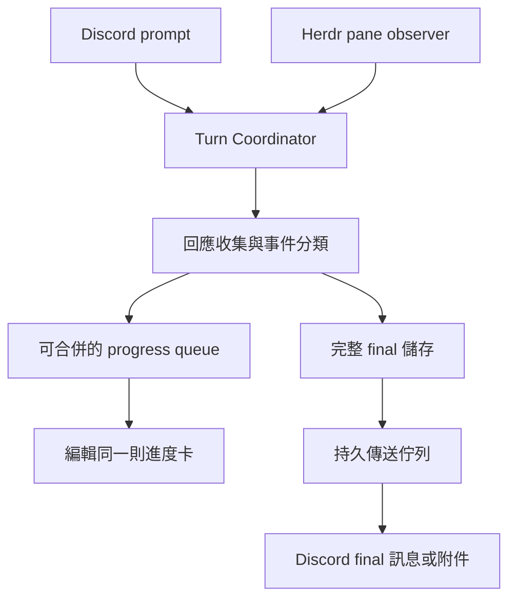

# Herdr Discord Bridge 回應事件與訊息呈現設計

日期：2026-09-07
狀態：第一版已實作，待真實 Discord 驗收；後續架構仍為提案
協作分工：Codex 整理事件生命週期與實作方向；agy 提出使用者體驗、訊息壓縮及 Discord 限制方案；active Codex 彙整。

## 1. 背景與目標

目前 CLI 有正常回應，但 Discord 偶爾顯示 `(no output)`；長回覆也可能造成 final response 擷取失敗。使用者希望前段看到工具使用與進度，後段收到完整回答，並保留問題與回答的 context。

本設計涵蓋：

- Discord 發問後的進度與完整 final response。
- Discord live queue／rolling preview 與 tool progress、final 分離的取捨。
- 直接在 Herdr pane 發問時，將問題與回答鏡像到明確綁定的 Discord thread。
- 長內容、來源缺失、限流、部分送達及重啟復原。

## 第一版實作範圍（2026-09-07）

Agent 在 Herdr 內產生的回應是正式來源；本文討論的是擷取完整性與問答對應，不是質疑來源可信度。

- 保留 working／blocked／finished。以約十秒的更新間隔呈現最新 1,500 字元的 CLI 尾端預覽；這是輪詢，不是逐 token streaming。
- Codex 在發問前依 Herdr agent_session ID 找到本機 CODEX_HOME/sessions 下唯一對話紀錄並建立 byte cursor，只讀後續事件。
- 以 task_started、相符 user_message 與 task_complete 對應問答；只用 phase=final_answer 的 agent_message 作為 final，不讀 reasoning 作為回答。
- final 獨立送出，長 Markdown 分段並補齊跨段 code fence；全部送達後才顯示 finished。
- blocked／unknown 不當成完成；終端模式需四次成功且不變的 idle/done 讀取，再保持十秒穩定，才結案。
- preview 編輯失敗不阻斷 final。final 部分傳送失敗明確顯示 delivery failed/partial。
- agy 或 Codex transcript 無法使用時保留最長的 prompt 範圍擷取片段，明確標示非完整 final。這不是完整增量 transcript，也不保證移出畫面的內容可恢復。
- 替換 Agent session 時停止追蹤，避免接到另一個 Agent 的回答。
- 未新增 mirror 指令、持久送達佇列、重啟補送、agy 結構化 adapter 或附件模式；這些仍屬下述後續規劃。
- Codex 紀錄格式屬本機版本相依介面；bridge 與 Agent 必須能存取相同 CODEX_HOME/session 檔案。此版本不自動解析另一個 pane 的自訂 HOME，也不存取遠端檔案。

下文的 event contract 與完整架構是目標設計，不代表全部已落地。

## 2. 建議架構

採用「滾動進度卡＋獨立完整 final」。Agent 執行完成、回應擷取完成及 Discord 送達完成是三個不同狀態。

| 層面 | 建議 |
| --- | --- |
| Tool／進度 | 單則 rolling preview，合併頻繁更新 |
| Final response | 獨立發布，完整保留，不受 preview 字數限制 |
| 傳送佇列 | Progress 可合併；final 持久保存、依序送達與重試 |
| 發問來源 | Discord 與 Herdr pane 共用 turn lifecycle |



進度卡顯示狀態、耗時與最近 1～3 個工具摘要。工具次數可以顯示，但沒有可靠分母時不顯示百分比。過程摘要可壓縮；final 原文不可因預覽限制而刪減。

### 模組責任

- **Source Adapter**：取得結構化事件、transcript 或終端 snapshot，回報來源能力與缺失。
- **Turn Coordinator**：管理一次問答的身分、狀態、來源及固定的路由。
- **Response Collector**：收集內容、識別邊界與完整性，避免較短 snapshot 覆蓋完整內容。
- **Progress Presenter**：合併工具與公開進度摘要，產生滾動卡片。
- **Delivery Outbox**：持久保存 final、分段與送達狀態，處理重試及重啟復原。

## 3. Event contract

### 共用識別欄位

```text
eventId、turnId、sequence、timestamp
agentSessionId、terminalId、paneId
origin: discord | herdr_pane
routeId、routeVersion
source: structured | transcript | terminal
```

`turnId` 代表一次問答，不能以 pane 或 Agent session 代替。`sequence` 用於同一 turn 的事件排序。來源尚無可靠 session 識別時，需使用明確的本地觀察世代，不能把新 occupant 當成原 Agent。

| 事件 | 意義 |
| --- | --- |
| `turn.started` | 新問答建立；prompt 附 `complete / partial / unavailable` |
| `progress.updated` | 公開進度摘要，可合併更新 |
| `tool.started / finished` | 有可靠來源可辨識的工具活動 |
| `turn.blocked / resumed` | 等待核准或輸入，以及恢復工作 |
| `response.delta` | 帶有內容位置或 message 識別的回應增量 |
| `capture.gap` | 來源斷裂、清屏或漏失，記錄完整性問題 |
| `response.finalized` | final 已整理，附 `complete / partial / unavailable` |
| `turn.ended` | 工作結束，區分 completed、cancelled、failed |
| `delivery.updated` | pending、sending、partial、delivered、failed |

### 契約規則

- `blocked` 是暫停，不是 final；`unknown` 不能判定完成。
- Agent 結束後，收集器仍可等待延遲到達的 final，並採有界重試。
- `response.finalized` 不代表 Discord 已送達。
- 只轉發公開 commentary、工具摘要與回答，不轉發隱藏推理。
- 無法可靠分類時，不把任意終端文字宣稱為工具事件或 final。
- 重送事件需去重；同一 turn 的 final 分段需保持順序。
- 來源缺失與確實沒有文字回答是不同結果。

## 4. `(no output)` 與長回覆修正方向

以下為程式檢視所確認的風險，不代表已重現每一次歷史失敗。

| 現行行為 | 可能後果 |
| --- | --- |
| 依完整 prompt 字串定位 | 多行、折行或終端呈現差異使定位失敗 |
| 與最初 baseline 比較 | baseline 被捲出後無法找到交集 |
| `lastOutput` 被新 snapshot 取代 | 較短畫面可能覆蓋較完整內容 |
| 非 working 都累計 settled polls | unknown／blocked 被提前當成結束 |
| preview 編輯與讀取放在同一個 catch | 擷取失敗與 Discord 傳送失敗難以區分 |
| final 傳送前先宣告完整回覆在下方 | 傳送失敗時呈現錯誤成功狀態 |

### 來源優先順序

1. 評估 Codex、agy 是否提供可用的結構化 turn／message 事件或完整 transcript。
2. 優先使用明確 session、turn、message 邊界識別 final。
3. 終端 snapshot 作為相容來源，持續增量收集並偵測缺口。
4. 無法取得完整來源時明確標示缺失，不宣稱片段是完整 final。

增加到 2,000 或更多行不能保證解決問題。Herdr 操作規則指出，alternate screen 已移出的內容可能不在 host scrollback；輪詢之間漏掉的內容也無法靠 diff 還原。

取最後一個 `>`／`›` 也不能單獨當答案邊界：程式碼、引用及下一輪輸入都可能包含相同符號。增量收集需要處理重繪、重複片段、截斷及內容位置，不能把每次 snapshot 直接追加。

### 診斷與使用者訊息

分開記錄來源讀取錯誤、邊界解析失敗、內容缺口、Agent 狀態與 Discord 傳送錯誤。診斷應能以 turnId 串起各階段，避免預設記錄完整敏感內容。

等待取得 final 時：

```text
Agent 已結束，正在取得最終回覆…
```

最終仍有缺失時：

```text
Agent 已結束，但 Bridge 未能取得完整回覆。
已保留可取得的片段；擷取狀態：內容缺失。
```

只有來源明確確認沒有文字回答時，才呈現「本次沒有文字回答」。

## 5. Discord 訊息生命週期

1. **問題**：引用 Discord 原始問題；Herdr 本地問題另發訊息並標示來源。
2. **進度卡**：同一則訊息更新狀態、耗時與最新工具摘要。
3. **等待／收集**：區分等待核准與正在取得 final。
4. **Final**：獨立發布，保留 Markdown 與跨段程式碼格式。
5. **收尾**：全部送達後，進度卡才顯示已完成並送達；內容不完整時仍需保留缺失標記。

Discord 一般訊息 content 上限為 2,000 字元。切段需預留標題、段號與程式碼 fence 空間，優先按段落／換行切割，超長單行仍須安全分段。跨段程式碼區塊需閉合並重新開啟。[Discord 訊息文件](https://docs.discord.com/developers/resources/message)

### 超長回答模式

| 模式 | 呈現 |
| --- | --- |
| `inline` | 完整分段，直接在 thread 閱讀 |
| `attachment` | 前段預覽＋完整 `response.md` 附件 |
| `auto` | 超過設定段數後改附件 |

建議第一版預設 `inline`。agy 提議以約 3 則訊息作為改用附件的體驗門檻，但實際門檻仍待確認，應依分段後結果而非單純字數決定。附件失敗需保留原文並提供替代送達方式；預覽若不是摘要，應明確標示為節錄。

### 節流與部分送達

進度卡先採約 10 秒更新一次；內容無變化也更新已耗時。這是產品節流設定，不是 Discord 固定額度保證。實際排程遵循 rate-limit headers 與 `retry_after`，避免與 Discord SDK 的重試機制互相放大。[Discord 限流文件](https://docs.discord.com/developers/topics/rate-limits)

- Progress 採最新狀態覆蓋待送舊狀態，避免堆積。
- Final 保存各段內容、chunkId、狀態、message ID 與重試資訊。
- 部分送達後僅重試剩餘段落；不重發已確認的段落。
- API 已接受但回應遺失時需對帳，不能直接承諾絕對 exactly-once。
- Discord 不可用時，本地保留待送內容，恢復後接續。
- 若尚能編輯進度卡，顯示「已送達 N/M 段，等待重試」；若整體 API 不可用，不能假設錯誤通知本身會送達。
- 補送應讀取保存的 turn 回應；一般 `/herdr read` 讀取當下終端，不能保證補回歷史完整內容。
- 關閉意外 mentions，避免轉發文字觸發不必要的通知。

## 6. Herdr pane 本地發問鏡像

延續 [待做功能](pending-features.md) 中的 opt-in mirror 提案：

```text
/herdr use w2:p1
/herdr mirror on
/herdr mirror off
/herdr mirror status
```

啟用時建立來源基準，只接收之後的新 turn。不能只看到 `idle → working` 就宣稱捕捉到新問題，因為這也可能是核准後恢復。

- 明確綁定 pane／Agent session 與 Discord thread。
- Discord-origin turn 與 mirror observation 關聯去重，不再派送回 Herdr。
- turn 開始時固定目的 thread，避免途中 `/use` 使回應換路由。
- Agent 替換、pane 移動或來源中斷時重新驗證。
- prompt 未捕捉完整時明確標示，不虛構問題內容。
- 重啟後只在 cursor 仍可靠時接續，否則標示缺口。
- 缺失、未授權或多重目的地歧義時不廣播。
- 只有狀態變化而沒有可靠 prompt 邊界時，最多標示偵測到本地活動，不宣稱取得完整問答。

目標是保留可信的「問題 → 過程摘要 → 回答」，不是將所有終端活動全量公開。

## 7. Regression tests

| 類別 | 案例與驗證重點 |
| --- | --- |
| 擷取 | 多行 prompt、重複問題、答案含提示符、超過 3,000 行工具輸出；不得串錯 turn |
| 畫面變動 | 清屏、重繪、snapshot 縮短、無 overlap、alternate screen 缺失；不得假造完整性 |
| 結束判斷 | 極短任務、idle 早於 final、blocked/resume、unknown、取消及退出 |
| 分類 | tool/commentary 不混入 final；不可辨識內容不假標 final；不轉發隱藏推理 |
| Discord 格式 | 長 Markdown、跨段 code fence、Unicode、超長單行及附件失敗 |
| Discord 傳送 | 429、斷線、部分成功、回應遺失、進度卡遭刪除；final 不被 preview 失敗阻斷 |
| 復原 | 重啟後繼續待送 final；重複事件不重複發布；送達不確定時對帳 |
| Mirror | opt-in、本地 prompt、Discord 發問去重、session 替換與綁定變更 |

使用可重播來源事件、終端 snapshot fixture、可控制時鐘及 fake Discord API 驗證。完整來源與有缺口來源需分別斷言，不能以沒有能力恢復的 fixture 要求保證完整輸出。

## 8. 實作階段規劃

| 階段 | 工作 | 完成條件 |
| --- | --- | --- |
| 1. 來源與問題驗證 | 確認兩種 CLI 的事件／transcript 能力；建立失敗案例與診斷分類 | 列明可保證與不可保證的擷取情境 |
| 2. Turn lifecycle 與收集 | 事件契約、blocked／unknown 判斷、增量保存與完整性標記 | 回應不串輪、不被較短 snapshot 覆蓋；缺口可辨識 |
| 3. Discord 呈現與傳送 | rolling progress、獨立 final、Markdown 分段、持久佇列及復原 | 長文與部分送達可恢復；進度失敗不阻斷 final |
| 4. Pane mirror | 接入同一 coordinator，加入綁定、基準及來源去重 | 本地問答正確送往指定 thread，無回送循環 |
| 5. 整合驗證 | Codex／agy 長回答、核准恢復、斷線重啟及本地發問 | 端到端驗收與來源能力矩陣一致 |

## 9. 待確認事項與限制

- 最優先確認兩種 CLI 是否有可靠的完整回應來源，以及對現有互動式 pane 的適用性。
- 決定 final 的有界等待時間、來源缺失時的補讀政策。
- 確認超長回答的預設模式、附件門檻與大小上限處理。
- 定義持久回應的保存期限、空間上限及清理政策。
- 定義 mirror 關閉時，已開始 turn 的後續送達行為。
- 明確標示來源能力降級；終端 snapshot 無法提供結構化 transcript 等級的完整性保證。

## 10. 相關文件

- [待做功能：Herdr direct interaction mirror](pending-features.md)
- [已知問題](known-issues.md)
- [Team orchestration specification](team-orchestration-spec.md)
- [Team orchestration implementation plan](team-orchestration-plan.md)


## 2026-09-09 狀態耗時更新

working 後顯示已耗時，streaming 每 10 秒刷新（於下一次輪詢送出）。首張狀態卡與 final 不必等待十秒週期。finished 後顯示總耗時，從本輪回應追蹤開始計算至觀察到完成，包含 blocked 等待，不含 final 的 Discord 傳送時間。保留既有資料收集輪詢頻率，避免因畫面刷新變慢而漏掉來源資料。待重啟後實際 Discord 驗收。
